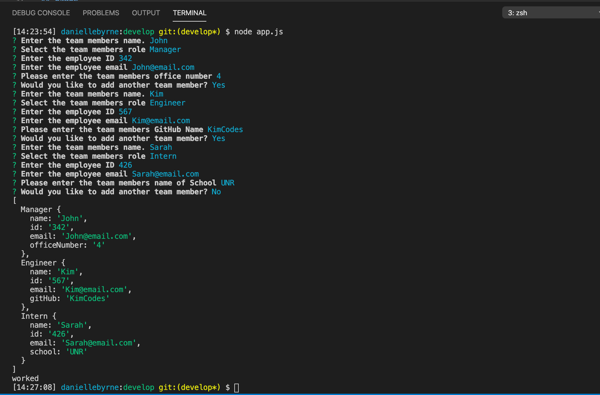
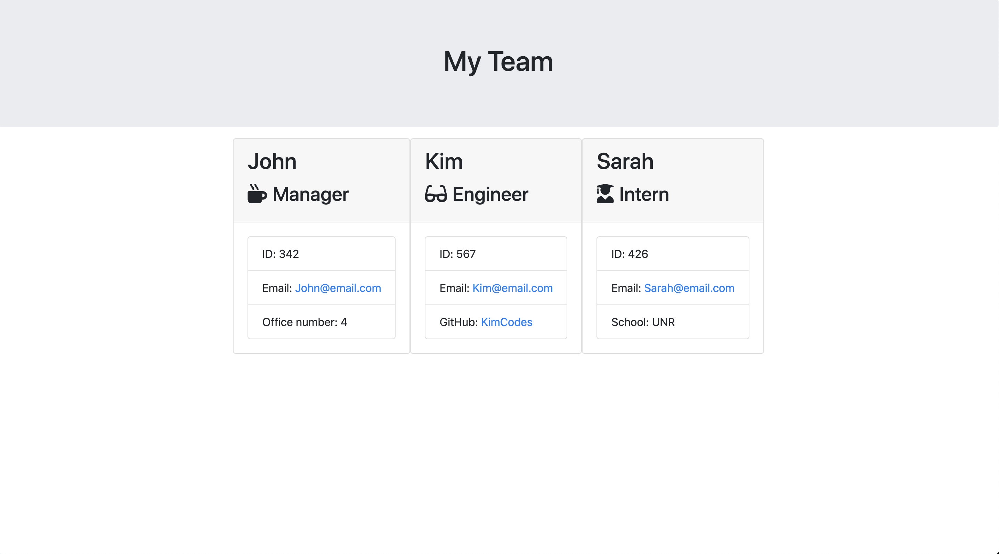

# Team Profile Generator Homework

[Link to GitHub] (hhttps://github.com/DanielleByrne/gt-team-profile-generator-homework)

## Table of Contents 

* [Installation](#installation)
* [Usage](#usage)
* [Credits](#credits)
* [License](#license)

## Installation

Clone the repository from GitHub, run npm install, and run the app.js application

## Usage 

This project is comprised of multiple HTML and JS files to create an HTML team profile page with generated team members

## Credits

This was a project I completed as a homework assignment in my Georgia Tech Coding Bootcamp. I used some profided starter code and files as well as the Inquirer npm package, Jest and Node.JS

* [npm Inquirer](https://www.npmjs.com/package/inquirer)
* [Node.JS](https://nodejs.org/en/)
* [Jest](https://jestjs.io/en/)

## License

MIT License

Copyright (c) [2020] [Danielle Byrne]

Permission is hereby granted, free of charge, to any person obtaining a copy
of this software and associated documentation files (the "Software"), to deal
in the Software without restriction, including without limitation the rights
to use, copy, modify, merge, publish, distribute, sublicense, and/or sell
copies of the Software, and to permit persons to whom the Software is
furnished to do so, subject to the following conditions:

The above copyright notice and this permission notice shall be included in all
copies or substantial portions of the Software.

THE SOFTWARE IS PROVIDED "AS IS", WITHOUT WARRANTY OF ANY KIND, EXPRESS OR
IMPLIED, INCLUDING BUT NOT LIMITED TO THE WARRANTIES OF MERCHANTABILITY,
FITNESS FOR A PARTICULAR PURPOSE AND NONINFRINGEMENT. IN NO EVENT SHALL THE
AUTHORS OR COPYRIGHT HOLDERS BE LIABLE FOR ANY CLAIM, DAMAGES OR OTHER
LIABILITY, WHETHER IN AN ACTION OF CONTRACT, TORT OR OTHERWISE, ARISING FROM,
OUT OF OR IN CONNECTION WITH THE SOFTWARE OR THE USE OR OTHER DEALINGS IN THE
SOFTWARE.

## Contributing

If you created an application or package and would like other developers to contribute it, you will want to add guidelines for how to do so. The [Contributor Covenant](https://www.contributor-covenant.org/) is an industry standard, but you can always write your own.

---
© 2019 Trilogy Education Services, a 2U, Inc. brand. All Rights Reserved.